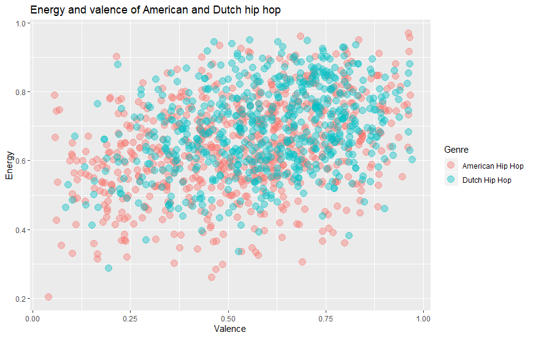
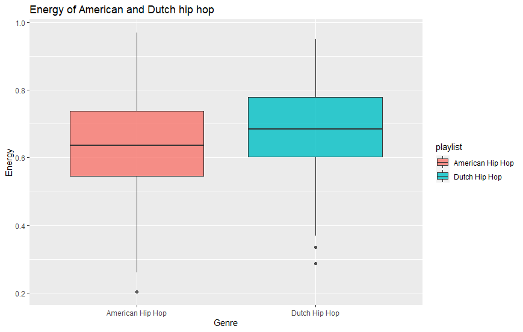

# Computational Musicology
# Ilja van Ipenburg (11862904)

# Week 1

The corpus I will be using are two playlists, one consisting of American Hip Hop and one consisting of Dutch Hip Hop. Right now both playlists consist of about 600-700 songs, which were collected through the most popular playlists for both search terms. The playlists represent the two genres pretty well, they contain both older and newer songs and consist mostly of the most popular songs in both genres.

I looked at four features that looked the most relevant for a comparison right now. These four features are: 'danceabiltiy', 'valence', 'energy' and 'speechiness'. For these four features, the mean, median, maximum and minimum were computed. To keep it clear, I will show all the values right now:

# Danceabiltiy
US:

M=0.751, SD=0.122, MD=0.768,  MIN=0.28, MAX=0.969

NL:

M=0.764, SD=0.123, MD=0.782,  MIN=0.35, MAX=0.972

# Valence
US:

M=0.530, SD=0.219, MD=0.545,  MIN=0.04, MAX=0.967

NL:

M=0.597, SD=0.189, MD=0.61,  MIN=0.08, MAX=0.972

# Energy
US:

M=0.636, SD=0.137, MD=0.637,  MIN=0.203, MAX=0.97

NL:

M=0.688, SD=0.123, MD=0.685,  MIN=0.288, MAX=0.961
# Speechiness
US:

M=0.227, SD=0.130, MD=0.232,  MIN=0.02, MAX=0.856

NL:

M=0.200, SD=0.117, MD=0.184,  MIN=0.03, MAX=0.84

The values for danceabiltiy are very similar for both playlists, but the mean and median values for valence and energy are both higher for Dutch Hip Hop which seems promising for further exploration. This while the mean and median values for speechiness are higher for American Hip Hop. This could also be related to the lower energy and valence values of American Hip Hop. 

When looking at outliers a funny find was that the track with the highest energy from the American Hip Hop playlist is "Hey Ya" by OutKast, which is obviously one of the most popular hip hop songs that is known for it's high energy. When looking at the lowest energy hip hop song from the same playlist, it is still very obviously a hip hop track, but also from another side of the spectrum. The highest energy song from the Dutch playlist seems to be a remix of a non-Dutch song, judging from this, the playlists still need to be cleaned to remove these kind of songs. 

Furthermore some songs in the playlists didn't seem to have any values for the features yet, these seem to be very new songs, so these must also be removed. 

# Week 2

This plot shows the valence and energy of both the American and Dutch hip hop playlists plotted against eachother. Something that can be seen pretty immediately is that the points are way more concentrated in the upper right corner, which shows that Dutch hip hop in general is more happy and more energetic.

This plot explores the energy of both playlists more, and strengthens the point that Dutch hip hop is more energetic than American hip hop.
